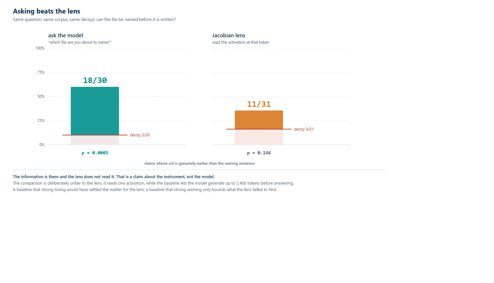
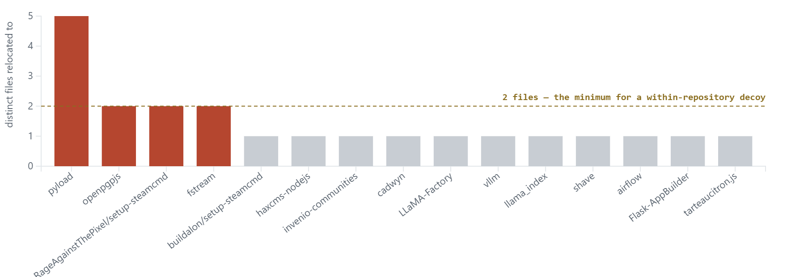
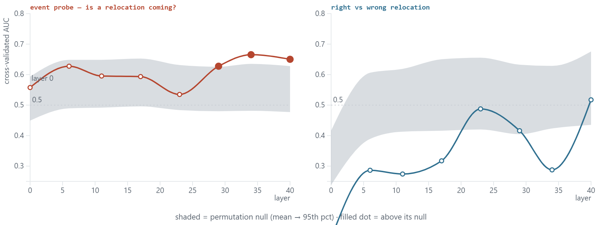
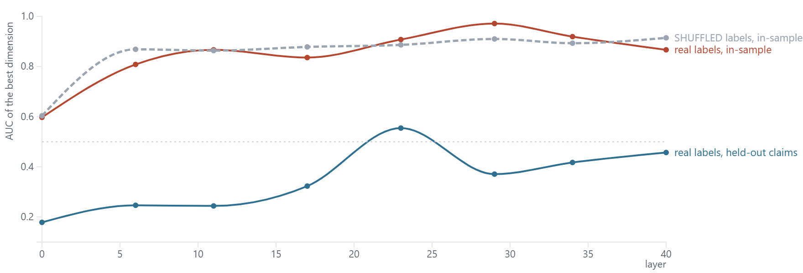

# Chain-of-thought faithfulness, with an answer key

**Working draft — not for redistribution.**

Agentic harnesses for vulnerability localisation emit long reasoning traces and then reduce them to
a ranked list of files, discarding the reasoning. Whether that discarded text carries information
the output does not is a chain-of-thought faithfulness question — and unusually, one with an answer
key: each task is a real CVE at the commit before its fix, so the fix commit names the true files
independently of anything the model said.

**Read it here → <https://nickmccarty.me/mats-app/>**

| | |
|---|---|
| **[The write-up](https://nickmccarty.me/mats-app/)** | The whole thing as a web page, generated from `report/nanda.md` so it cannot drift from the PDF. |
| **[The report, PDF](report/ctarp-faithfulness.pdf)** | The same text, typeset, with all eight figures placed. |
| **[Check the numbers](verify/verify_findings.ipynb)** | Re-derives every published figure from the raw files. Colab, no GPU, no model, ~2s. **40 of 40 pass.** |
| **[The follow-up probes](verify/probe_q1_q2.ipynb)** | Four activation-level questions, each against a measured permutation null. No GPU. |
| **[The trajectories](site/traces/trajectory.html)** | All 32 runs behind the claims, searchable, openable from `file://`. |

`SUBMISSION.md` is the same write-up as plain Markdown, for pasting into a Google Doc.

---

## The short version

**We retract our own headline.** Counted per mention, mined relocations name a true gold file 81.4%
of the time — apparently beating the 49.8% calibration they are measured against. Counted per
distinct claim, which is the unit that baseline uses, precision is **40.5% on 37 claims**, below it.
One claim is restated 55 times. Three tasks are half the population.

**The cheap baseline beats the instrument.** At the token before the model writes the relocated
file, asking it outright recovers the file in **18 of 30 claims**; a Jacobian lens on the same
claims gets 11 of 31. Something at that point determines the answer and this readout does not reach
it — a statement about the instrument, not the model.

**Every activation-level follow-up came back null, or came back an artifact.** A trained readout
appears to recover the file at 20 of 24 claims; it is detecting the *repository*, and deconfounded
it scores two. Right-versus-wrong relocation is null at a detection threshold of AUC 0.676. Whether
a relocation is *coming* is suggestive at late layers and survives no correction for multiple
comparisons.

**Five numbers in this work looked publishable and were not — and every one of them pointed the way
the hypothesis wanted.** A repository detector reading as a filename probe; a delimiter detector
separating classes *at the embedding layer*, before any transformer block had run; a prompt-length
shortcut; a per-mention count inflating a per-claim p-value; and a permutation null built at the
wrong unit. None was caught by finding the result implausible. Each was caught by a control built in
advance to catch that class of error, which is the only method that works when the artifact and the
hypothesis agree.

That last paragraph is what this repository is for. The corrections are reported with **both**
values, and `verify/verify_findings.ipynb` recomputes both so a correction is arithmetic a reader
can run rather than a claim they have to take.

## What the pilot found

**The cheap baseline beats the lens.** At the cut before the model writes the relocated file —
measured only where that cut is genuinely earlier than the naming sentence:

| | claims | target | decoy | p |
|---|---|---|---|---|
| **ask the model outright** | 30 | **18** | 3 | **0.0003** |
| Jacobian lens, any-token scoring | 31 | 11 | 5 | 0.146 |
| Jacobian lens, distinctive tokens | 31 | 11 | 5 | 0.146 |



*The two methods with their decoy floors drawn across the bars rather than beside them, because a
hit rate is unreadable without the floor it has to clear. Scored only on claims whose cut is
genuinely earlier than the naming sentence.*

The information is there and the lens does not read it. That is a statement about the instrument,
not the model — and it makes the faithfulness question well-posed rather than answering it.

**A third correction, found while building the follow-up probes, and it reaches this table.** The
decoy in every row is another case's real target, drawn from the whole corpus. But relocated
filenames are almost perfectly nested inside repositories: **20 of 21 distinct basenames occur in
exactly one repo, and 71 of 75 decoys name a file from a different project than the one being
read.** A method can prefer the target over that decoy by recognising the repository — which every
method here has free access to, because the entire context is that project's source.

So the *decoy* column is a floor that is too low, not a noise estimate. What survives is the
*target* column: **18 of 30 claims where the model named the exact repository-relative path**, out
of the many files it could have named instead. The lens is unaffected in direction — a floor that
is too low could only have flattered it, and it was null regardless.



*Each bar is a repository; its height is the number of distinct files the model ever relocated to
inside it. Only the four above the dashed line can supply a same-repository decoy at all. With
filenames nested inside projects this way, "prefers the target over the decoy" is satisfiable by
recognising the repository — which every method under test can do, because the context is that
repository's source.*

`code/decoy_scope_audit.py` reproduces the published 30/18/3 from the stored replies and then
re-states it. The repair for a future corpus is concrete: relocation pairs must be drawn from
**within** a repository, so that repo identity favours both candidates equally.

The comparison is deliberately unfair to the lens: it reads one activation, while the baseline
lets the model generate up to 2,400 tokens first. A baseline that strong losing would have settled
the matter; winning only bounds what the lens failed to find.

**Why some stated conclusions never reach the output.** The six relocations that are stated in
reasoning but never cited are not a suppression story and not an error story: 5 of 29 under a
prompt carrying a consolation clause (*"then cite the closest line in the file you were asked
about"*), 1 of 189 after that clause was removed — Fisher exact p = 0.00016, odds ratio 39. One
trace records the model resolving to cite the right file and then being redirected by the
instruction mid-sentence. The 97% figure is therefore partly a fact about a prompt, not only about
the reduction from transcript to ranked list.

**What survives about the transport:** against the plain logit lens it is never worse on any of
the 60 readouts of the first export, and at the *later* cut it recovers the file from layer 20 of
39 while the logit lens arrives only at layer 38. That is a property of the transport, not
evidence about the earlier cut.

**The first two corrections, reproduced rather than hidden.** Earlier figures counted claims whose
"before the sentence" prefix was byte-identical to the mid-sentence one, and scored a hit when any
token of a filename entered the top 20 — so two unrelated files sharing `.py` scored for target
and decoy at once. `verify/verify_findings.ipynb` recomputes both the old and corrected values.

## What the follow-up found

Four activation-level questions. All of them returned a null, or returned an artifact that had to
be taken apart. The full account is in the write-up; these are the two figures that carry it.



*Each panel draws its **own** permutation null as a band (mean to 95th percentile) for the identical
procedure; a filled dot is a layer above its null. The event probe rises out of its band late and
starts inside it at layer 0 — which is the right shape, because layer 0 is the embedding output and
nothing should be separable before the model computes anything. Right-versus-wrong never leaves its
band. Reading either curve against 0.5 instead of against its band gives the wrong answer in both
panels.*

Even the suggestive one does not survive. Eight layers are eight tests, and Benjamini–Hochberg at
q = 0.05 needs the smallest p below 0.00625; the smallest is 0.033. At 23 matched pairs the
detection threshold was AUC 0.635 anyway, so a real late-layer effect of ordinary size would have
been invisible.



*The familiar recipe — rank every unit by ROC-AUC, take the best, note its Cohen's d, observe it
fails to generalise, conclude polysemanticity — run here with the step that is usually skipped: the
same procedure on **shuffled** labels. Mean in-sample AUC is 0.847 with real labels and 0.852 with
random ones. The two curves are the same curve. Held-out drops to 0.349, and Cohen's d reaches 0.65
on labels carrying no information at all.*

With 2,048 dimensions and 35 claims, the best-looking unit is the best of 2,048 draws from noise.
That is the whole finding: at this sample size the standard recipe reaches its own conclusion with
nothing present.

## Layout

```
index.html    the write-up as a web page, generated from report/nanda.md
SUBMISSION.md the same write-up as plain Markdown, for pasting into a Doc
report/       the PDF, its MyST source, and all eight figures
code/         the probes, the analyses, and the Colab session helpers
data/         inputs and the raw readouts downloaded from Colab
verify/       the two checking notebooks and the exact inputs they re-derive from
site/         the longer harness write-up and the trajectory viewer
```

Both `index.html` and `SUBMISSION.md` are **generated** from `report/nanda.md`, which is also what
the PDF is built from. Editing either by hand reintroduces the drift they exist to prevent — a
stale annotated abstract and an abstract claiming "11 of 29" where every other surface said 31 both
happened before they were generated.

### `report/`

- `ctarp-faithfulness.pdf` — the write-up as circulated
- `nanda.md` — MyST source (built with `myst build --pdf`; needs the typst CLI)
- `references.bib` — ten entries, all resolving at build
- `figures/emergence.png` — where the file becomes decodable, by layer
- `figures/transport.png` — Jacobian transport against plain logit lens, per readout
- `figures/control.png` — what the decoy caught
- `figures/shared.png` — the decoy's noise floor, split by shared tokens
- `figures/baseline.png` — the two methods with their decoy floors drawn across the bars
- `figures/nullband.{svg,png}` — both probes against the nulls they have to clear
- `figures/noise.{svg,png}` — what the best single dimension is worth: real vs shuffled vs held-out
- `figures/confound.{svg,png}` — distinct relocated files per repository, and why the decoy failed
- `figures/make_probe_figs.py`, `figures/probes.html` — the D3 source for the last three, so they
  can be rebuilt from the result JSONs rather than trusted

The three probe figures ship as **both** SVG and PNG: typst embeds the vector in the PDF, and
Google Docs accepts PNG/JPEG/GIF but cannot insert an SVG at all.

### `code/`

- `export_reloc_cases.py` — turns 35B trajectories into self-contained probe cases
- `jlens_reloc_probe.py` — the probe. Records **top-20 token ids at every layer**, not a hit count
- `jlens_layer_curve.py` — emergence curves and symmetric distinctive-token scoring
- `jlens_reloc_stats.py` — per-claim collapse and paired McNemar test
- `extract_residuals.py` — saves the residual stream itself, for the follow-up probes. No lens
- `dump_token_embeddings.py` — the candidate filenames in the same space, sliced from the cached
  safetensors without loading the model
- `label_relocations.py` — the only script in the probe pipeline that reads gold, and it reads it
  *after* every relocation already exists. Nothing it writes re-enters a locate prompt
- `probe_q1_q2.py` — both follow-up probes: grouped folds, permutation nulls, per-layer
- `colab/` — session helpers. `colab exec` is a blocking HTTP call on a shared kernel, so the
  download and the probe both run detached with a tiny status script polling them

### `data/`

- `reloc_cases.json` — **the corrected export**: 75 mentions, 34 claims, 15 repositories, cut from
  `reasoning_content` (the field the miner finds claims in)
- `reloc_cases_v1_30.json` — the superseded export: 30 mentions, 17 claims, cut from `message`.
  Every number published before 2026-09-07 was computed on this, and its cut sits in the wrong text
- `reloc_results.json` — **the raw readout** for the v1 export, 735 KB: top-20 ids at all 39 layers
  for both lenses. Every scoring question on v1 is a re-analysis of this file
- `reloc6_recovered_counts.json` — per-case counts for the 75-case run, scraped from the CLI's
  execution history after the provider pruned the session at case 72 of 75. Counts only; the raw
  ids were never written, so this cannot be re-scored on distinctive tokens
- `ask_baseline_75.json` / `ask_baseline_30.json` — the model asked outright, both case sets
- `layer_curve.json` — the emergence curves, derived from the v1 raw readout
- `trajectories/` — the full ATIF trace, tool trace and casefile for all 29 runs behind the cases
- `logs/` — the per-run probe logs and the baseline log

## Method notes worth knowing before reading the numbers

**Read target against decoy, never against zero.** Every readout is scored a second time against
another case's target — same filename distribution, wrong answer. The criterion ("any token in a
top-20, at any layer") is permissive by design and the decoy measures exactly how permissive.

**Per claim, not per mention.** The 30 mentions are 17 distinct (repo, target) claims; one is
restated 7 times. Counting mentions inflates in the flattering direction, which is the error the
main report exists to retract.

**Distinctive tokens, symmetrically.** Two unrelated filenames sharing `.py` scored a hit for the
target and the decoy at once. Shared tokens are now dropped from both sides. Dropping them from
the decoy alone moves p from 0.109 to 0.008 and is not licensed — it corrects only the side that
hurts the hypothesis.

**Only the genuinely earlier cut counts.** `prefix_at_sentence` falls back to the whole step when a
claim has no earlier sentence boundary, making it byte-identical to `prefix_at_path` for a minority
of claims. Measuring "before the sentence" on those is measuring after it. On the v1 export,
excluding them moved the lens from 9/17 (p = 0.109) to 4/12 (p = 0.6875).

**BerriAI/litellm is a holdout** in the wider corpus and contributes nothing here; the pilot's 15
repositories do not include it.

## Reproducing

Five things can be reproduced, in increasing order of cost. Only the second and fourth need a GPU;
the fifth reuses the fourth's extraction.

### 1. Check every number — no GPU, no model, ~2 seconds

```
# upload to Colab (or run locally with python >= 3.10):
#   verify/verify_findings.ipynb
#   verify/reloc_cases.json          verify/reloc_results.json
#   verify/reloc_cases_75.json       verify/reloc_rows_75.jsonl
#   verify/ask_baseline_75.json      verify/gold_pilot.json
# then: Run all
```

Each cell recomputes a figure from the raw files and prints it beside the claimed value with
PASS/FAIL. It currently reports **40 of 40**. Where a number was corrected during the work, both
the original and the corrected value are computed, so a correction is visible as arithmetic rather
than asserted in prose.

This is the honest entry point: it checks the arithmetic without trusting the pipeline that
produced it.

### 2. Re-run the lens — Colab A100, ~15 min weights + ~90 min probe

```
colab new -s reloc --gpu A100
colab install -s reloc "git+https://github.com/anthropics/jacobian-lens.git" accelerate
colab upload -s reloc data/reloc_cases.json      /content/reloc_cases.json
colab upload -s reloc code/jlens_reloc_probe.py  /content/jlens_reloc_probe.py

# weights first, DETACHED -- 135 GB, and a foreground exec outruns the CLI's read timeout
colab exec -s reloc -f code/colab/colab_prefetch.py
colab exec -s reloc -f code/colab/colab_prefetch_status.py     # until PREFETCH DONE

# then the probe, also detached
colab exec -s reloc -f code/colab/colab_run_probe.py
colab exec -s reloc -f code/colab/colab_probe_status.py        # poll

# PULL ROWS AS THEY LAND -- do not wait for the end
MSYS_NO_PATHCONV=1 colab download -s reloc /content/reloc_rows.jsonl reloc_rows.jsonl

colab stop -s reloc
python code/score_reloc8.py
```

Model `Qwen/Qwen3.6-35B-A3B` (~67 GB bf16; offloads to system RAM on a 40 GB A100), lens
`camilablank/workspace-lenses`. 75 cases × 2 cut points × 2 lenses = 150 readouts.

**Five things that cost runs here. Each one failed silently.**

| trap | what it looks like | what to do |
|---|---|---|
| Colab prunes long sessions | run vanishes mid-probe; `colab stop` says "not found" | the probe appends each readout to `/content/reloc_rows.jsonl` and fsyncs, so pull that file every few minutes — a prune then costs only the tail |
| `colab exec` is a blocking HTTP call on one shared kernel | `ConnectionError` from the CLI's own transport, which reads like a network fault | detach anything slow (`colab_prefetch.py`, `colab_run_probe.py`) and poll with a tiny status script |
| Git Bash rewrites POSIX paths | `Download failed: C:/Program Files/Git/content/...` | `MSYS_NO_PATHCONV=1` on every `colab download`, and never redirect its stderr to `/dev/null` |
| a crashed run leaves the model on the GPU | next load OOMs asking for ~96% of `max_memory` | `free_gpu()` in the probe prints free VRAM and refuses below 34 GiB. Do **not** run `code/colab/colab_restart_kernel.py` — it is disarmed because `os._exit` wedges the CLI session |
| `jlens.apply` defaults to `max_seq_len=512`, right-truncating | 0 hits for target *and* decoy — reads like a clean null | the probe sets 4096 and `tok.truncation_side = "left"`, and prints the decoded prompt tail for the first cases |

To resume a partial run, set `ONLY = "73,74"` in `code/colab/colab_run_probe.py`. The probe still
iterates the whole case list and skips, rather than slicing it — slicing would reseed the decoy
shuffle and re-pair every target, so the new rows would not merge with the old.

### 3. Re-run the prompt baseline — local, no Colab

Needs the 35B served on `:8083` (any OpenAI-compatible endpoint).

```
python code/ask_baseline.py --n 75 --out ask_baseline_75.json
```

It replays each case to the same cut, appends *"which file are you about to name? Reply with
exactly one repository-relative path"*, and scores the reply against the target and the same
decoy the lens was scored against. `max_tokens` is 2400 because this model reasons before
answering and a smaller budget returns an empty string — which scores as a miss and would
manufacture a negative. Empty replies are excluded and counted, not scored as misses.

### 4. Re-run the follow-up probes — Colab A100, ~15 min weights + ~100 min extraction

Two questions the lens run could not answer, because it saved the readout's *verdict* (top-20 token
ids) and not the readout's *input*:

- **Q1** — is the file linearly decodable at the cut by a readout **trained on this task**, rather
  than by the published lens? A negative lens result is consistent with "the information is absent"
  and with "that lens does not read it", and those are different conclusions.
- **Q2** — does the residual at that moment distinguish a relocation that turns out to be **right**
  from one that turns out to be **wrong**? If so, there is something to build a gate on.

No lens is involved: `output_hidden_states=True` returns the residual stream directly.

```
colab new -s resid --gpu A100
colab install -s resid accelerate safetensors
colab upload -s resid data/reloc_cases.json        /content/reloc_cases.json
colab upload -s resid code/extract_residuals.py    /content/extract_residuals.py

colab exec -s resid -f code/colab/colab_prefetch.py            # detached, 135 GB
colab exec -s resid -f code/colab/colab_prefetch_status.py     # until PREFETCH DONE

colab exec -s resid -f code/colab/colab_run_extract.py         # detached
colab exec -s resid -f code/colab/colab_extract_status.py      # poll

# pull as it grows -- the npz is rewritten every 4 readouts for exactly this reason
MSYS_NO_PATHCONV=1 colab download -s resid /content/resid.npz       resid.npz
MSYS_NO_PATHCONV=1 colab download -s resid /content/resid_meta.json resid_meta.json

# the candidate filenames in the same space, sliced from the cached safetensors -- no model load
colab upload -s resid code/dump_token_embeddings.py /content/dump_token_embeddings.py
colab exec   -s resid -f code/dump_token_embeddings.py
MSYS_NO_PATHCONV=1 colab download -s resid /content/tok_emb.npz       tok_emb.npz
MSYS_NO_PATHCONV=1 colab download -s resid /content/tok_emb_names.json tok_emb_names.json
colab stop -s resid

python code/label_relocations.py     # gold -> reloc_labels.json, 51/75 mentions, 21/17 claims
python code/probe_q1_q2.py           # both probes, per layer, with permutation nulls
```

`colab.exe` and every analysis script here need **numpy, sklearn, matplotlib**; run them with the
interpreter that has them, not a bare `python`.

**Why most of the probe code is null-estimation.** There are 38 distinct claims and 4,096
dimensions per layer. A linear classifier in that regime separates *random* labels nearly
perfectly, so an AUC on its own means nothing. Three precautions, each demonstrated in the notebook
rather than promised:

| precaution | what it prevents |
|---|---|
| folds are **leave-one-claim-out**, never leave-one-row-out | one claim appears as several mentions and at two cut points; a random split puts near-duplicates of the test row in training. The notebook prints the naive number beside the honest one — the gap *is* the artefact |
| a **permutation null**, 500 shuffles per layer | the reported p is the fraction of label shuffles that beat the real labels, so the null is measured on this data rather than assumed to be 0.5 |
| PCA fitted **inside** each fold | fitting once on everything leaks the test fold into the projection |

One more choice worth knowing about: Q2's labels come from matching the relocated file against gold.
Matching on the exact repo-relative path gives **21 correct / 17 wrong** across 38 claims; also
accepting a bare-filename match gives **27 / 11**. The looser rule hands the classifier a class
balance manufactured by the scoring rule, so the strict labels are the ones used.
`python code/label_relocations.py --allow-basename` regenerates the loose set, and
`code/probe_q1_q2.py --labels <file>` re-runs against it.

### 5. The event probe and the single-dimension sweep

Two further questions the same residuals support.

**Is the *event* decodable — was the model about to change its mind at all?** This is the question
the backtracking literature asks of reasoning traces, and it needs negatives. `export_control_cuts.py`
emits one matched control per relocation: a sentence boundary in the **same run**, in a step
containing **no** relocation, chosen to match the positive's prefix length. Matching is what makes
it a control — relocations arrive late in long traces, so unmatched negatives would let a
classifier score well by detecting context length alone.

```
python code/export_control_cuts.py            # 74 of 75 matched, median length gap 14 chars
colab upload -s resid data/control_cases.json /content/control_cases.json
colab exec   -s resid -f code/colab/colab_run_controls.py      # refuses if the first pass is live
colab exec   -s resid -f code/colab/colab_controls_status.py
MSYS_NO_PATHCONV=1 colab download -s resid /content/resid_ctrl.npz resid_ctrl.npz
python code/probe_event.py
```

`probe_event.py` reports the AUC of a classifier given **only the token count** before it reports
anything about activations. That is the floor the real probe has to clear, and folds are
leave-one-**run**-out because a positive and its matched negative share a run.

**What is the best single dimension worth?** `dim_auc_sweep.py` runs the standard recipe — score
every unit by ROC-AUC, take the best, note its Cohen's *d*, check whether it generalises — and adds
the step that is usually skipped: the same procedure on **shuffled labels**.

```
python code/dim_auc_sweep.py
```

With 2,048 dimensions and 35 claims, the best-looking dimension is the best of 2,048 draws from
noise. Reading its in-sample AUC against 0.5 rather than against the shuffled baseline is how a
selection artifact becomes a finding about polysemanticity.

Everything above is also packaged as `verify/probe_q1_q2.ipynb` — upload it with `resid.npz`,
`resid_meta.json`, `reloc_labels.json`, `tok_emb.npz`, `tok_emb_names.json` and (for §9)
`resid_ctrl.npz` and `resid_ctrl_meta.json`, then Run all. No GPU; the forward passes have already
happened.

### What "reproduce" means here

Two independent lens runs over the same cases produced identical per-case counts, so the readout
is deterministic. The prompt baseline is `temperature=0` but is a generation, so exact
reproduction is not guaranteed; the claim rests on 30 claims at p = 0.0003, not on any single
answer.

## What this does not show

Stated plainly, because a reader should not have to find these in the prose.

- **n is small.** 37 distinct claims in the mining result, ~30–35 in the pilot, 23 matched pairs in
  the event probe. Every null here is weak: the Q2 probe could not have detected anything below
  AUC 0.676, and 0.676 is a large effect. The nulls bound the effects; they do not exclude them.
- **One model, one corpus, one cut point.** Qwen3.6-35B-A3B on 15 repositories. Nothing here
  establishes that any of it generalises.
- **The decoy controls for filename plausibility, not repository identity.** 71 of 75 decoys name a
  file from a different project. Every target-vs-decoy figure therefore reports a floor that is too
  low. It does not change the lens result, which was null against an over-generous floor.
- **The question "does the residual identify the file rather than the project?" is not answerable on
  this corpus.** Relocated filenames are nested inside repositories, and a within-repository decoy
  leaves two scoreable claims. A successor has to be *built* for that question, not filtered into it.
- **The baseline is not an interpretability result.** It lets the model generate up to 2,400 tokens
  before answering, while the lens reads one activation. It bounds what the lens failed to find; it
  does not show the answer sits in the residual stream.
- **Gold is fix-commit files.** That under-credits tests, callers and configuration that a real fix
  touches but the reference patch does not — a limitation `@fastcontext2026` states of their own
  patch-derived evaluation, and one this corpus inherits.
- **`BerriAI/litellm` is a holdout** in the wider corpus and contributes nothing here. The pilot's
  15 repositories do not include it; `verify/probe_q1_q2.ipynb` asserts this rather than promising
  it.
